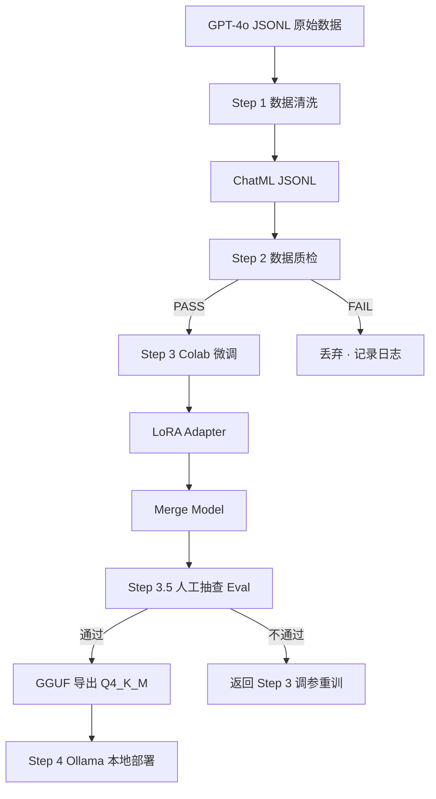

# ProjectA_Architecture.md

**项目名称**：南宁电信本地化知识蒸馏与边缘部署  
**文档类型**：MAR (Markdown Architecture Record)  
**版本**：v2.0  
**日期**：2026-03-01  
**状态**：Chief Architect 批准 · 进入 Step 1 代码编写阶段

------------------------------------------------------------------------

# 1. 项目目标

构建一条"极简清洗 → 云端防 OOM 微调 → 本地量化部署"的流水线，将 GPT-4o 合成的含 `<think>` 思维链数据蒸馏至 1.5B 小模型，并部署至 4GB 显存设备运行。

**CoT 蒸馏目标说明**：不要求 1.5B 模型具备通用涌现推理能力，只要求其在"南宁电信宽带与弱电排障"这一极窄领域内，学会结构化输出 `<think>` 思维链格式。

**场景锁定声明**：本项目仅覆盖宽带与弱电排障场景，不涉及套餐咨询、账单查询、投诉处理等其他客服场景，以保护 1.5B 模型参数效能。

------------------------------------------------------------------------

# 2. 硬件约束

## 本地（Windows + GTX 1050Ti 4GB）

- 仅允许量化模型推理运行
- 不可进行任何大模型训练
- 最终模型必须为 GGUF Q4_K_M 格式

## 云端（Colab T4 16GB）

- 使用 4bit 量化 + QLoRA
- 严格控制 batch size 防止 OOM

------------------------------------------------------------------------

# 3. 总体架构流程



------------------------------------------------------------------------

# 4. 数据 Schema

## 4.1 原始格式（GPT-4o 输出）

GPT-4o 合成时需在 prompt 中**显式要求**模拟输出思维链结构，否则不会自动产生 `<think>` 标签。

```json
{
  "instruction": "...",
  "input": "",
  "output": "<think>此处为排障推理过程</think>此处为最终答复"
}
```

## 4.2 清洗后 ChatML 格式

```json
{
  "messages": [
    {
      "role": "system",
      "content": "你是南宁电信宽带与弱电排障专家，只负责解答宽带故障、弱电施工与线路排查相关问题。"
    },
    {
      "role": "user",
      "content": "..."
    },
    {
      "role": "assistant",
      "content": "<think>...</think>..."
    }
  ]
}
```

------------------------------------------------------------------------

# 5. Step 1 数据清洗

**技术栈**：`json` + `re`  
**输出文件**：`nanning_chatml.jsonl`

## 处理规则

| 规则 | 说明 |
|------|------|
| 逐行读取 | 每行一条 JSONL，解析失败直接丢弃并记录 |
| 保留 `<think>` 标签 | 清洗过程中不得破坏标签结构 |
| 超长保护策略 | 若 output 超过 1500 tokens，**直接丢弃该条数据**，不做截断，避免 `<think>` 标签被截断导致结构残缺 |
| 拼装 ChatML | 按 §4.2 格式组装 messages |
| 输出 | 写入 `nanning_chatml.jsonl` |

## 伪代码逻辑

```python
for line in raw_jsonl:
    item = json.loads(line)
    output = item["output"]

    # 保护 <think> 完整性：超长直接丢弃
    if count_tokens(output) > 1500:
        log(f"DISCARD: token超限 → {item['instruction'][:30]}")
        continue

    # 验证 <think> 标签存在
    if "<think>" not in output or "</think>" not in output:
        log(f"DISCARD: 缺少think标签")
        continue

    chatml = build_chatml(item)
    write(chatml)
```

------------------------------------------------------------------------

# 6. Step 2 数据质检

**技术栈**：`pytest` 或 `assert` 脚本  
**前置条件**：Step 1 输出的 `nanning_chatml.jsonl`  
**结论**：PASS 才可上传 Colab，FAIL 直接丢弃并记录日志

## 6.1 格式校验

- JSON 可解析
- 包含 `messages` 字段
- roles 必须为 `system` / `user` / `assistant` 三者之一
- `assistant` content 必须同时包含 `<think>` 与 `</think>`

## 6.2 内容长度下限校验（新增）

- `assistant` content 去除 `<think>...</think>` 部分后，**正文长度不得低于 20 字**
- 防止模型生成空回复或过于简短的无效答案

```python
final_answer = re.sub(r"<think>.*?</think>", "", assistant_content, flags=re.DOTALL)
assert len(final_answer.strip()) >= 20, "FAIL: 正文过短"
```

## 6.3 文本相似度去重（新增）

- 使用 `sentence-transformers` 计算 `user` content 的 embedding
- 若与已有数据余弦相似度 > 0.85，**丢弃后者**，保留先入库的条目
- 目的：避免训练集同质化，提升数据多样性

```python
from sentence_transformers import SentenceTransformer, util
model = SentenceTransformer("paraphrase-multilingual-MiniLM-L12-v2")

seen_embeddings = []
for item in dataset:
    emb = model.encode(item["user_content"])
    for seen in seen_embeddings:
        if util.cos_sim(emb, seen) > 0.85:
            log("DISCARD: 相似度过高")
            break
    else:
        seen_embeddings.append(emb)
        keep(item)
```

------------------------------------------------------------------------

# 7. Step 3 Colab 微调

**模型**：`Qwen/Qwen2.5-1.5B-Instruct`  
**框架**：Unsloth + TRL + PEFT + bitsandbytes

## 7.1 训练参数

| 参数 | 值 | 备注 |
|------|----|------|
| LoRA r | 16 | |
| LoRA alpha | 32 | |
| batch_size | 2 | 防 OOM |
| grad_accum | 4 | 等效 batch=8 |
| **epochs** | **2** | 防过拟合（由3调整为2） |
| max_seq_len | 2048 | |
| eval_steps | 每50步 | 监控验证集 loss |
| 量化加载 | 4bit | bitsandbytes |

## 7.2 训练流程

1. 4bit 加载基础模型
2. 注入 LoRA Adapter
3. SFTTrainer 训练，监控 eval loss
4. 若 eval loss 在 epoch 2 结束后仍未收敛，返回调参
5. `merge_and_unload` 合并 LoRA 到基础模型
6. 导出为 HuggingFace 格式

------------------------------------------------------------------------

# 8. Step 3.5 人工抽查 Eval（新增）

**时机**：Merge 完成后，GGUF 导出前  
**目的**：人工确认模型在目标场景下的回复质量，避免低质模型进入部署

## 8.1 抽查方式

- 从测试集中随机抽取 **30条** 排障场景问题
- 分别输入：① 原始 Qwen2.5-1.5B-Instruct（基线）② 微调后模型
- 人工对比评分

## 8.2 评分维度

| 维度 | 说明 |
|------|------|
| 结构完整性 | `<think>` 标签是否出现且闭合 |
| 推理合理性 | `<think>` 内容是否符合排障逻辑 |
| 答复准确性 | 最终答复是否解决用户问题 |
| 语言流畅度 | 是否自然、无重复、无乱码 |

## 8.3 通过标准

30条中，微调模型在综合评分上**优于基线的比例 ≥ 70%**，视为通过，允许进入 GGUF 导出。  
否则返回 Step 3 重新调整参数重训。

------------------------------------------------------------------------

# 9. Step 4 量化导出与本地部署

## 9.1 GGUF 导出

```bash
python convert_hf_to_gguf.py ./merged_model --outtype q4_k_m --outfile nanning_telecom_q4km.gguf
```

## 9.2 本地部署

- 工具：Ollama
- 精度：GGUF Q4_K_M
- 存储重定向（避免 C 盘占满）：

```cmd
mklink /j C:\Users\<user>\.ollama\models D:\OllamaModels
```

## 9.3 模型构建与运行

```bash
ollama create nanning-telecom -f Modelfile
ollama run nanning-telecom
```

**Modelfile 示例**：

```
FROM ./nanning_telecom_q4km.gguf
SYSTEM "你是南宁电信宽带与弱电排障专家，只负责解答宽带故障、弱电施工与线路排查相关问题。"
PARAMETER temperature 0.3
PARAMETER num_ctx 2048
```

------------------------------------------------------------------------

# 10. 风险备案

| 风险 | 概率 | 应对 |
|------|------|------|
| 1.5B CoT 学习效果差 | 中 | Step 3.5 Eval 兜底，不达标则降级为纯 SFT（去除 `<think>`）|
| Colab T4 OOM | 中 | batch=2 + grad_accum=4，必要时降至 batch=1 |
| 数据量不足 500 条（清洗后） | 低 | 原始合成目标设为 650 条，留 150 条 buffer |
| GGUF 转换精度损失过大 | 低 | Eval 阶段对比 Q4_K_M 与 FP16 回复，可降级至 Q5_K_M |

------------------------------------------------------------------------

# 11. 变更记录

| 版本 | 日期 | 变更内容 |
|------|------|----------|
| v1.0 | 2026-02-28 | 初稿 |
| v2.0 | 2026-03-01 | 依据 Chief Architect 批示全面升级：CoT 方案锁定、场景收窄至宽带排障、截断策略改为丢弃、质检增加长度校验与去重、epochs 调整为 2、补充 FAIL 路径、新增 Step 3.5 人工 Eval 环节、新增风险备案 |

------------------------------------------------------------------------

> **Chief Architect 批准状态**：✅ 已批准  
> **下一步**：进入 Step 1 数据清洗代码编写阶段
